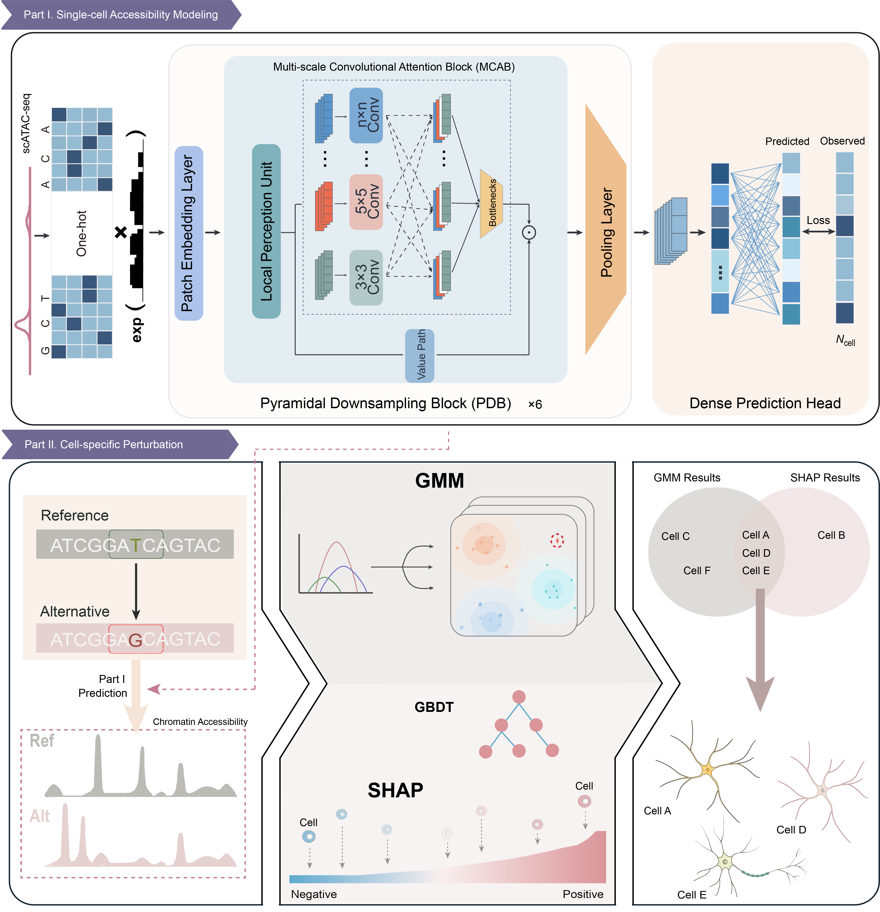

# **DINOSNN**

Welcome to the `DINOSNN` framework repository! `DINOSNN` is a computational framework based on chromatin accessibility perturbation modeling to decode cell type-specific regulatory effects of noncoding variants using single-cell ATAC-seq data (scATAC-seq). DINOSNN consists of two components: the first employs a deep neural network to model scATAC-seq profiles and predict single-cell chromatin accessibility. The second component identifies functional noncoding single-nucleotide polymorphisms (SNPs) by quantifying chromatin accessibility differences between reference and variant sequences, enabling precise mapping of SNP-induced cell type- and region-specific regulatory effects in the brain.

# **Requirements**

Please create a new conda environment specifically for running `DefunCNVDINOSNN` (e.g. `conda create --DINOSNN python=3.8.20`), install the packages listed in the `requirements.txt` file. Install with conda or pip (e.g. `conda install pandas==2.0.3`).
